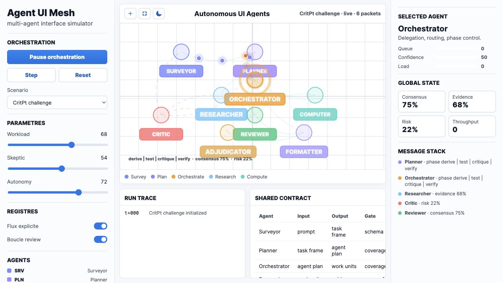

# Agent UI Mesh

Standalone HTML showcase for visualizing a mesh of specialized agents collaborating on a complex task.

## Live Demo

[Open the Vercel deployment](https://agents-ui-showcase.vercel.app)



## What It Shows

- Agent roles for survey, planning, orchestration, research, calculation, review, critique, adjudication, and formatting.
- A luminous node graph with role capsules, agent faces, and relationship arcs.
- A self-contained static interface with no build step.

## Run Locally

```bash
python3 -m http.server 8770
```

Then open:

```text
http://localhost:8770
```

## Project Structure

```text
index.html       Full standalone UI
docs/            README screenshot assets
```
